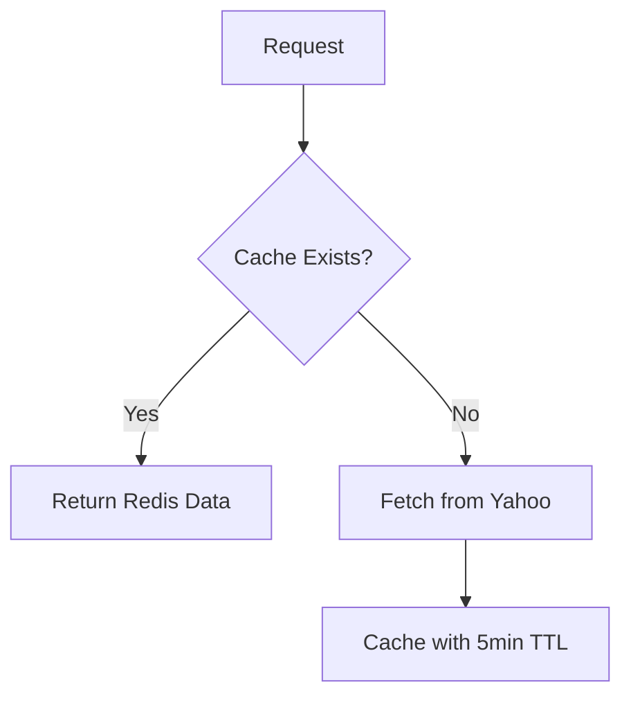
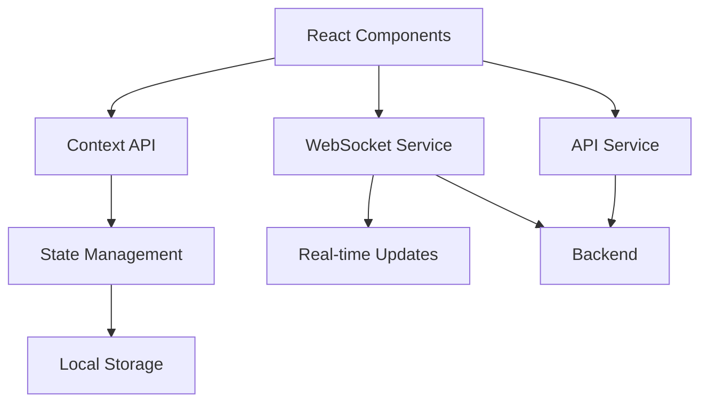
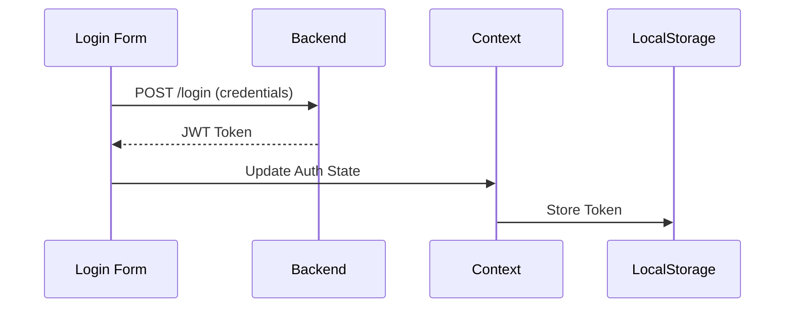
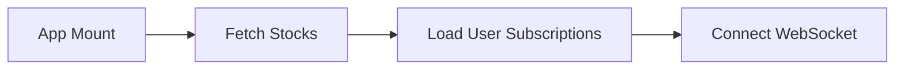

## StockTrack - Full Stack Stock Market Tracker (Documentation)

## 🌟StockTrack Backend 

## 📌 Overview

 **The StockTrack backend is a real-time stock market tracking system that provides:**
 
 - ✅ User Authentication (JWT-based)
 - ✅ Stock Data Fetching (Yahoo Finance API)
 - ✅ Real-time Updates (WebSocket + Redis Pub/Sub)
 - ✅ Caching (Redis for fast data retrieval)
 - ✅ Background Jobs (Scheduled stock updates)

**Built with Node.js, Express, MongoDB, Redis, and WebSocket, this system efficiently manages stock data and delivers updates to users in real time.**


## 🌐 System Flow

```mermaid
flowchart
    participant User as User (Frontend)
    participant API as Yahoo Finance API
    participant Server as Backend (Node.js)
    participant Redis as Redis (Cache + Pub/Sub)
    participant MongoDB as MongoDB

    Note over Server: Scheduled Job (Every 5 mins)
    loop Batch Processing (10 stocks/batch)
        Server->>API: GET /quotes (Batch of 10)
        API-->>Server: Stock data
        Server->>Redis: Cache all stocks (HSET)
    end

    Note over Server: Real-Time Updates
    Redis->>Server: Pub/Sub "stock_updates"
    Server->>MongoDB: Query subscribed users
    MongoDB-->>Server: User list
    loop For each subscribed user
        Server->>Redis: Get user's stocks (HGET)
        Redis-->>Server: Stock data
        Server->>User: WebSocket (stockUpdate)
    end
```

## 📂 System Architecture
 1. Core Components

Component	    | Technology	         | Purpose
API Server	    | Express.js	         | REST API for user/auth & stock data
Database	    | MongoDB	             | Stores user profiles & subscriptions
Cache	        | Redis	                 | Caches stock data for fast access
Real-time       | Comms WebSocket        |(Socket.IO)	| Live stock updates to clients
MQ (Pub/Sub)	| Redis Pub/Sub	         | Broadcasts stock updates internally
Background Jobs	| Node.js Cron	         | Fetches stock data periodically

**🔧 Step-by-Step Workflow**

1. User Authentication

  **🔹 Flow:**

 * User registers (POST /api/auth/register)

 * User logs in (POST /api/auth/login) → Gets JWT token

 * Token is used for protected routes (e.g., fetching subscribed stocks)

  **🔹 Security:**

 * JWT token stored in HTTP-only cookie (secure)

 * Redis checks for API availability

2. Stock Data Fetching & Caching

   **🔹 How it works:**

  - Scheduled Job runs every 5 minutes (configurable)

  - Fetches stock data from Yahoo Finance API in batches (rate-limited)

  - Processes & caches data in Redis (for fast retrieval)

  - Publishes updates via Redis Pub/Sub

   **🔹 Redis Caching Strategy:**

  - Hash storage: stocks:symbol → {price, change, lastUpdated}

  - Cache-first approach:

  - If Redis has data → return immediately

  - If not → fetch from API → cache it



3. Real-time Updates (WebSocket + Redis Pub/Sub)
   
  **🔹 Flow:**

  - User connects via WebSocket (/ws endpoint)

  - Server checks JWT token for auth

  - User joins a private room (user_<ID>)

  - When new stock data arrives:

  - Redis Pub/Sub broadcasts update

  - WebSocket sends it to subscribed users

## 🔹 Optimizations

- **Single Redis subscriber** - Efficient broadcasting of updates
- **User-specific rooms** - Only relevant updates sent to each client

## ⚙️ Key Features & Logic

✅ Rate-Limited API Calls
 - Yahoo Finance API has rate limits → 2-second delay between batches

 - If rate-limited → waits 60 seconds & retries

✅ Background Stock Updates
 - startStockUpdateJob() runs periodically

 - Updates cache + notifies users via WebSocket

✅ User Stock Subscriptions
 - Users can subscribe to up to 15 stocks

 - Stored in MongoDB (User.subscribedStocks)

 - Real-time updates only for subscribed stocks

##  🚀 Setup & Deployment

 - **🔧 Environment Variables** 
  -- .env
   * MONGO_URI=mongodb://localhost:27017/stocktrack  
   * REDIS_HOST=localhost  
   * REDIS_PORT=6379  
   * JWT_SECRET=your_secure_jwt_secret  
   * RAPIDAPI_KEY=your_yahoo_finance_api_key  
   * CORS_ORIGIN=http://localhost:5173  
   * STOCK_UPDATE_INTERVAL=300000 (5 mins)  


 ## 📌 Running the Backend
   **Install dependencies:**

  -- bash
   * npm install
   * Start Redis & MongoDB locally

  **Run the server:**

  -- bash
   * npm start
   The system will:

    * Connect to MongoDB

    * Initialize Redis cache

    * Start WebSocket server

    * Begin periodic stock updates

## 🔐 Security Considerations

   * JWT authentication for all protected routes

   * Redis health checks before processing requests

   * Rate-limited API calls to avoid bans

   * WebSocket authentication (prevents unauthorized connections)

## 📌 Conclusion

 **This backend efficiently:**

  * Manages user data (MongoDB)
  * Caches stock prices (Redis)
  * Broadcasts real-time updates (WebSocket + Redis Pub/Sub)
  * Handles scheduled jobs (background updates)


# 🌟StockTrack Frontend System
# StockTrack Frontend System

## 🎨 Frontend Architecture


# 📦 Core Components

###  1. Authentication Flow



### 2. Stock Dashboard

| Component           | Technology     | Purpose                                   |
|---------------------|---------------|------------------------------------------|
| `StockList`         | React         | Displays all available stocks            |
| `StockCard`         | CSS Modules   | Shows individual stock data with styling |
| `SubscriptionToggle`| Context API   | Manages user subscription state          |

Key Features:
- Real-time price updates via WebSocket
- Responsive grid layout
- Optimized re-rendering with React.memo

# 🛠️ Setup Guide

* Environment Variables
  - VITE_API_URL=http://localhost:3000
  - VITE_WS_PATH=/ws

* Installation
  - npm install
  - npm run dev

# 🔄 Data Flow


## 🎯 Key Features

### 🔄 Real-Time Data Flow
- **Live Price Updates**: Instant stock price changes pushed via WebSocket
- **Visual Change Indicators**: Color-coded (green/red) arrows showing price movements
- **Delta Updates**: Only changed stock data transmitted to minimize bandwidth

### 🛠️ User Subscription Management
- **Interactive Toggle**: Single-click stock subscription/unsubscription
- **Selection Limits**: Enforces 15-stock maximum per user
- **Instant Sync**: Changes immediately reflected across all devices

### 📊 Optimized Performance
- **Smart Caching**: Stores stock data locally between updates
- **Memoized Components**: Prevents unnecessary re-renders
- **Batch Updates**: Groups WebSocket messages for efficiency

### 🔒 Security Features
- **Token Validation**: JWT verification on every WebSocket message
- **Protected Routes**: Authentication required for subscription changes

### 📱 Responsive Experience
- **Mobile-First Design**: Fully functional on all screen sizes
- **Adaptive Layout**: Grid reorganizes based on viewport
- **Touch-Friendly**: Larger tap targets for mobile users

### 🔄 Background Synchronization
- **Offline Support**: Queues subscription changes when disconnected
- **Auto-Retry**: Reconnects WebSocket if connection drops
- **Data Recovery**: Fetches latest prices on reconnection


# 🛡️ Frontend Security

  * JWT stored in memory after login

  * Protected routes component

  * Input sanitization for all forms

  * WebSocket connection validation


# 📌 Integration Points


| Backend Service    | Frontend Consumer       | Communication Protocol |
|--------------------|-------------------------|------------------------|
| `/api/auth`        | `AuthContext.js`        | REST (HTTPS)           |
| `/api/stocks`      | `useStocks.js` Hook     | REST (HTTPS)           |
| WebSocket          | `useWebSocket.js` Hook  | WS/WSS                 |
 
